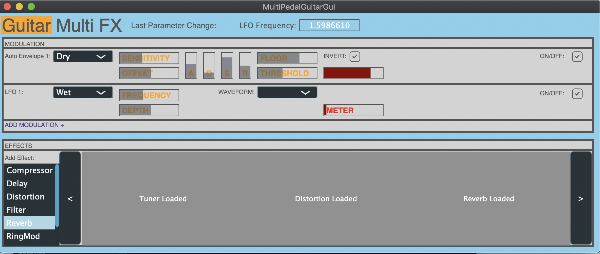

# Guitar Multi Pedal Gui

*Multi-effect gitaar pedaal in Pure Data, met LFO en Auto-Envelope aan te sluiten op bijna elke parameter.*

## Onderzoek Eigen Gui

### Hoe ervaar jij de gebruiker interactie met de app/plugin zoals deze nu is? 

Deze patch heb ik jaren geleden eigenlijk voornamelijk voor mezelf gemaakt tijdens de vooropleiding van de HKU. Er is dus weinig rekening gehouden met coherentie en bruikbaarheid voor andere gebruikers. Op het eerste gezicht is het ontzettend onoverzichtelijk en als je geen verstand hebt van Pure Data denk ik ook gewoon ronduit onbruikbaar. Geen documentatie, geen help file of iets dergelijks, de verschillende effecten staan overal door elkaar en zodra ze met kabels verbonden zijn ziet het er nog veel erger uit. Ook zijn de helft van de parameters niet gelabeld en de andere helft is er lukraak tussen gegooid zoals bij de compressor te zien is. Er valt veel te verbeteren aan dit project.

### Welke GUI elementen werken goed? Hoe komt dat? 

De tuner is overzichtelijk, heeft 1 kabel ingang die overduidelijk voor signaal is. 1 Knop om hem aan te zetten en een meter om aan te geven hoe dicht je bij de noot in de buurt zit. Simpel maar effectief en meer is er ook niet nodig voor een tuner behalve eventuele extra functionaliteit zoals verschillende stemtonen.

De Delay ziet er ook overzichtelijk uit, alles is gelabeld en staat op 1 lijn met elkaar. Dat zorgt voor structuur en overzicht. Voor de distortion geldt hetzelfde.

Het hele idee achter de patch was dat je zelf een volgorde kon maken zoals je ook zou kunnen doen met normale gitaarpedalen en vervolgens meerdere LFO’s, of auto-envelopes aan de parameters zou kunnen hangen om modulatie te creëren. Dit werkt goed met Pure Data omdat je zoveel kopieën van deze instanties kunt maken als je zelf wilt. 

### Welke GUI elementen werken nog niet goed (genoeg)? Hoe komt dat? 

Zoals gezegd hebben de meeste effecten redelijk veel inputs waar je de LFO/envelope aan kan hangen. Deze zijn niet gelabeld of hebben geen duidelijk informatie betreffende wat er precies gemoduleerd gaat worden. Nu kun je natuurlijk met trial and error snel vinden wat er precies gemoduleerd wordt omdat de rode lijn naast de sliders de beweging van de modulatie laat zien maar dit moet makkelijker en overzichtelijker kunnen.

Ook zijn, zoals eerder gezegd, een hoop sliders niet eens gelabeld en het spreekt redelijk voor zich waarom dat niet goed is.

Tot slot is het, nadat alle kabels verbonden zijn, een enorm visueel zooitje en kan je eigenlijk weinig kaas maken van de audioflow tenzij je netjes alle subbatches op een rijtje schuift. Dit moet makkelijker gemaakt kunnen worden in de plugin.

### Als je meer tijd zou steken in het ontwerp en implementatie, wat zou je dan eerst veranderd? Waarom zou je dat als eerste veranderen? 

Alles goed labelen en allignen zou een goede eerste stap zijn. Makkelijk om aan te passen en zorgt al voor een hoop duidelijkheid. Dit is eigenlijk de eerste stap in het überhaupt bruikbaar maken van deze patch/plugin. Als een plugin zijn sliders/parameters niet zou labelen zou ik het persoonlijk zelf nooit gebruiken.

### Zijn er leuke/interessante manieren van interactie met jouw app/plugin/etc. Die het gebruik van de app leuker/makkelijker kunnen maken? 

Wat met de Pure Data patch mooi is dat je veel instanties van hetzelfde effect of envelope kunt gebruiken en zelf een volgorde kan samenstellen, dit zou ik graag zo veel mogelijk willen bewaren in het prototype waar mogelijk.

## Grafische mockup 

*Mockup gemaakt met Adobe XD.*

### Onderbouwing ontwerp-keuzes mockup

Allereerst heb ik gekeken naar een handige onderverdeling. De modulatie mogelijkheden en effecten (+tuner) heb ik apart ingedeeld zodat duidelijk is in welk gedeelte je wat kunt doen. Bij het modulatie gedeelte kies je zelf om een LFO/envelope toe te voegen en je verbindt deze vervolgens aan een parameter en stelt de modulatie waardes in.

Bij de effecten heb Ik er voor gekozen om ze als een soort galerij op een rijtje te zetten waar je ze telkens toe kan voegen. Zo kun je met de scrollbars aan de zijkant precies zien wat de volgorde is van alle effecten en makkelijk aanpassingen doen. De bedoeling is dat je ze ook kunt verplaatsen en verwijderen waar nodig. De effecten staan allemaal in een lijst aan de zijkant zodat je makkelijk kunt kiezen wat je wilt toevoegen. Bij de parameters die gelinkt zijn met de modulatie staat het aangegeven, om het extra te verduidelijken.

Als er een parameter aangepast wordt komt dat boven in beeld te staan, met de waarde die je deze hebt gegeven. Dit voorkomt dat het hele scherm vol staat met getallen zodat het een wat overzichtelijker en minimalistischer geheel wordt. 

Op visueel aspect heb ik bij het GUI design van Joeri van zijn vorige distortion plugin en bij Freek’s huidige opdracht meegekeken. Zij hadden er voor gekozen om de label van de parameter in de slider zelf te zetten. Dit, gecombineerd met een semi-doorzichtige slider is een overzichtelijke en ergonomische oplossing om aan te geven wat een slider doet zonder het hele scherm vol te hoeven kwakken met tekst.

## Prototype 

### Keuze library en taal

Als taal heb ik C++ gekozen omdat dit de meest voor de hand liggende taal is op dit gebied. Snel en flexibel en wordt uiteraard veel in combinatie met audio-plugins en effecten gebruikt. Daarnaast heb ik gekozen voor de JUCE library om mijn kennis hier meer in uit te breiden, voornamelijk op het gebied van GUI en omdat dit een veelgebruikte library is in dit veld.

### Process 

*Geheel van het prototype*

Ik ben begonnen met een achtergrond in te delen, die vergelijkbaar is met de mockup: Een Modulatie gedeelte en een effect gedeelte. Dit om een duidelijke indeling te creëren voor de verschillende aspecten van het geheel. Vervolgens heb ik eerst het Modulatie gedeelte opgebouwd met de benodigde sliders en drop-down menu's en deze zodanig gelabeld. Deze sliders heb ik zoals aangegeven allemaal aangewezen naar 1 label zodat je goed kunt zien wat je zojuist aan het veranderen bent.

Elke keer als je een slider verandert komt er boven in te staan welke slider je verandert, en wat nu de waarde is. Zo kun je op een eerste blik zien wat de waardes ongeveer zijn en de exacte waardes uit deze label halen zonder dat er veel clutter aan getallen op het scherm hoeven te staan.

De drop-down menu's hebben onderverdeling in de verschillende plugins en daarna wat ze allemaal kunnen bereiken. Zo kun je makkelijk kiezen welke parameter gemoduleerd moet worden:

Als laatste heb ik een lijst met alle effecten gemaakt in een ListBox en deze aan een Drag and Drop Component gehangen; Dat wil zeggen dat je uit de lijst je effect zo kunt schuiven naar de plaats in de fx-chain waar je hem wilt hebben.

Deze functionaliteit heb ik nog niet uit kunnen breiden naar daadwerkelijke plugins door de korte deadline, maar de gehele GUI heeft al ontzettend veel bruikbaarheid en is naar mijn ogen redelijk overzichtelijk gebleven.
