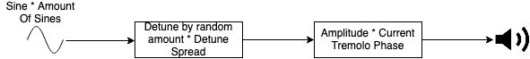
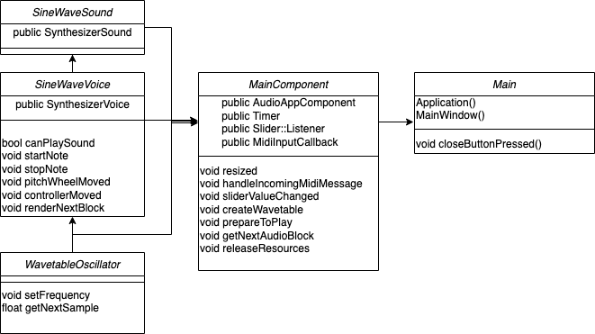

# Sine Stacker Synth

## Description

Sine Stacker Synth is a small wavetable synthesizer that allows you to stack
essentially infinite sine waves on each other. The sine waves then get randomly
spread every time you play a note over the spread size you set up. Which means
that every time you play a note the spread, or detune gets completely randomized
allowing for interesting sound design/sound scape noises. Finally a customizable
tremolo adjusts the amplitude of the sound to give the sound a more floating
feeling.

The wavetable is created by a sine wave calculated before being influenced by
pitch. After the amount of sines is set, the plugin creates the same amount of
instances of that sine with different oscillators. These are then supplemented
with pitch information and loaded into the buffer to be played, while the
amplitude is constantly adapted by the tremolo.

Its design is simple but effective, the random spread and wide range of
oscillators allow for a lot of different and new sounds even at the same pitch.
Low and high notes also completely differ in sound and the tremolo gives it a
nice fade for soundscapes.

### Usage

Open the projucer file and save as audio plugin or audio app to your IDE.

to change amount of sines change the sine slider:

```
sineSlider.setRange (Int Low, Int High);
```

### Audio Flow

Sine Wave Oscillator instances are created. Pitched accordingly with spread and
have their amplitude adjusted with the tremolo.



### System Diagram

System diagram with functions and inheritance.



### Demo

https://drive.google.com/drive/folders/12-GI5ZGRf89p40uyP7V7U1SNbv5oSz8k
